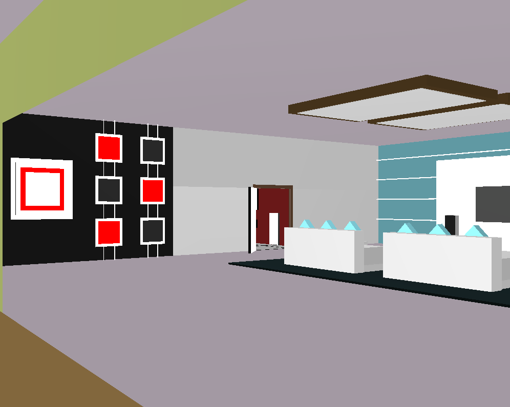

# 3D House Model in OpenGL

This repository contains a project that models a 3D house using OpenGL. The project demonstrates the use of geometric shapes, lighting and shading techniques, position transformations, and collision detection.

## Dependencies

To build and run the project, you need the following dependencies:

- **make**: [Install Make](https://www.gnu.org/software/make/)
- **g++**: [Install G++](https://gcc.gnu.org/)
- **OpenGL**: [Install OpenGL](https://www.opengl.org/)

## Compilation and Execution

To compile the project, simply run:

```bash
make
```

To execute the program:

```bash
./main
```

## Controls

- **Movement**: Use the **WASD** keys to move:
  - **W**: Forward
  - **A**: Left
  - **S**: Backward
  - **D**: Right
- **Camera Movement**: Use the arrow keys to move the camera.

|  |  |
|:----------------------------------:|:-------------------------------------:|


